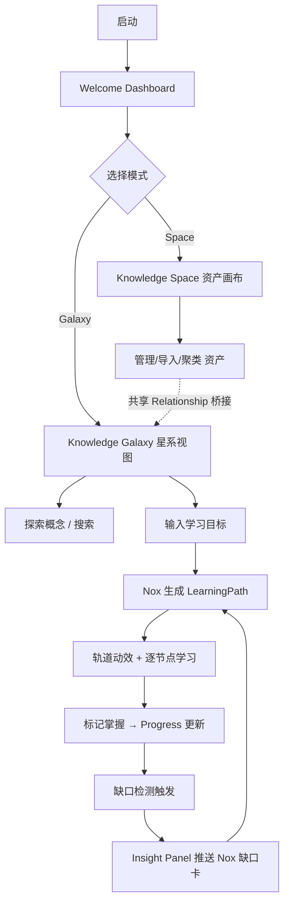

# DESIGN-KNOWLEDGE-GALAXY.md

> Knowledge Canvas v1.2 — Knowledge Galaxy 设计文档
> 阶段：设计（仅设计，不实现）｜ 参考：Learn Anything（interactive knowledge map / concept relationships / learning paths）
> 继承：v1.1 产品化优化（Apple/macOS 风格、三栏结构、Cluster Frame、AI Insight Panel、Mascot 系统）

---

## 0. 文档定位与约束

| 项 | 内容 |
|---|---|
| 阶段目标 | 将 Knowledge Canvas 从「AI 知识整理工具」升级为「AI Personal Knowledge OS」 |
| 参考对象 | [Learn Anything](https://learn-anything.xyz/) — Interactive Knowledge Map / 知识探索 / 概念关系 / 学习路径 |
| 产品化差异点 | 不只做知识地图，而是 **AI Employee 主动带你理解并补全知识世界** |
| 强约束 | **不修改** Knowledge Canvas v1.1 代码、**不修改** `llm-router`、**不修改** `agent-loop`、**不接真实 backend**、**不 commit**、**只设计** |
| 未来接线点（仅设计） | Embedding / Knowledge Graph / Memory / LLM Router — 本阶段不实现 |

> 本文档所有数据模型、接口形态均为**设计草案**，不写入 `packages/apps/knowledge-canvas-ui/` 任何源码；v1.3+ 实现前需二次评审。

---

## 1. 产品定位升级

| 维度 | v1.1 Knowledge Space | v1.2 Knowledge Galaxy |
|---|---|---|
| 动词 | 管理（manage） | 探索 + 理解 + 学习（explore / understand / learn） |
| 焦点 | 已有知识资产 | 知识之间的关系与个人认知成长 |
| 用户心智 | 「我的资料都在哪」 | 「我还不懂什么，AI 怎么帮我补齐」 |
| AI 角色 | 整理 / 聚类 / 发现关联 | **主动诊断知识缺口、生成学习路径、陪你学习** |

一句话价值：
**Knowledge Space 让你「拥有知识」，Knowledge Galaxy 让你「真正理解知识」——并由 AI Employee 主动导航。**

---

## 2. 信息架构图（Information Architecture）

```
┌──────────────────────────────────────────────────────────────────────────┐
│  MacWindowShell  ·  TitleBar                                             │
│  Mode Switch :  [ Knowledge Space ]  [ Knowledge Galaxy ✦ ]               │
├───────────────┬──────────────────────────────────────┬────────────────────┤
│  SideNav      │   CanvasRegion                        │  AI Insight Panel  │
│  (左栏)        │  (中栏)                                │  (右栏)             │
│               │                                       │                    │
│ ─ Space 视图 ─│  ── Mode A: Space ──                  │  · AI 发现          │
│ · 资产树      │  资产画布（现有 v1.1）                 │  · 建议 CTA×4       │
│ · 聚类列表    │  document/video/                      │    +〔生成学习路径〕 │
│ · 导入        │  conversation/project                 │  · 员工状态         │
│               │                                       │                    │
│ ─ Galaxy 视图│  ── Mode B: Galaxy ──                 │  ── Galaxy 态 ──    │
│ · 概念树      │  ★ 星系视图（径向/力导向）             │  · Nox 知识缺口雷达 │
│ · 学习路径    │  Concept / Skill /                    │  · 推荐学习路径     │
│ · 缺口雷达    │  Learning Path 节点                   │  · 下一步行动       │
│ · Employee   │  Cluster Frame（沿用）                 │                    │
└───────────────┴──────────────────────────────────────┴────────────────────┘
```

**关键新增点（相对 v1.1）：**
1. 顶栏 `Mode Switch`：Space ⇄ Galaxy 切换（全局视图切换，不重建 shell）。
2. 左栏 Galaxy 视图：概念树 / 学习路径 / 缺口雷达 / Employee 入口。
3. 中栏 Galaxy 星系视图：区别于资产画布的「概念/技能/路径」天体图。
4. 右栏 Insight Panel 在 Galaxy 态升级为「AI 学习导航器」，新增「生成学习路径」「下一步行动」。
5. Mascot 系统、Cluster Frame、ProviderStatus 完全沿用 v1.1。

---

## 3. 双模式设计（Dual Mode）

### Mode A — Knowledge Space（管理知识资产）
- **用途**：管理已有知识资产，沿用 v1.1 全部能力。
- **节点类型（沿用 v1.1 `KnowledgeNode.kind`）**：
  `document` / `video` / `conversation` / `project`
- **新增两类资产节点（归入 Space，作为 Galaxy 的输入语料）**：
  `memory`（长期记忆，呼应 AI Employee Memory）/ `task`（任务）
- **视图**：资产画布 + Cluster Frame + fit-to-content，与 v1.1 一致。

### Mode B — Knowledge Galaxy（探索知识关系）
- **用途**：探索概念关系、理解知识结构、按 AI 推荐路径学习。
- **新增节点类型（Galaxy 专属）**：
  `concept`（概念）/ `skill`（技能）/ `learningPath`（学习路径）
- **视图特性**：
  - 星系视图：概念为「星体」，关系为「引力连线」，学习路径为「轨道」。
  - 自动聚类：按主题/员工归属聚成星团（复用 Cluster Frame，AI 星团带 ✦ 标识）。
  - 焦点导航：点击概念星体 → 局部放大该概念邻域（hub 焦点逻辑沿用 v1.1 `isHub`）。

> **切换语义**：Space 的 `document/project` 是「知识的来源」，Galaxy 的 `concept/skill/learningPath` 是「知识的结构与成长」。两者通过 `Relationship` 桥接（见 §8）。

---

## 4. Knowledge Galaxy 节点设计

### 4.1 通用节点字段（所有 Galaxy 节点通用）

| 字段 | 含义 | 来源 |
|---|---|---|
| `title` | 标题 | 用户输入 / AI 生成 |
| `type` | 类型（concept / skill / project / learningPath） | 系统/AI 判定 |
| `relatedCount` | 关联知识数量 | Relationship 聚合 |
| `mastery` | 理解程度 0–100% | Progress（手动或 AI 推断） |
| `aiSuggestion` | AI 建议（一句话） | AIRecommendation |
| `nextActions` | 下一步行动（可点击） | AIRecommendation.actions |

### 4.2 节点类型细分
- **ConceptNode（概念）**：抽象知识单元，如「LLM Router」「Memory Architecture」。
- **SkillNode（技能）**：可执行的能力，如「Prompt Engineering」「Tool Calling」。
- **ProjectNode（项目）**：实践载体，Space 的 `project` 在 Galaxy 的映射。
- **LearningPathNode（学习路径）**：有序概念/技能链（见 §5）。

### 4.3 节点卡片示例（Concept：LLM Router）

```
┌─────────────────────────────────────────┐
│ ★ LLM Router            [技术概念]       │
│ 关联：Agent · Provider Manager · Memory  │
│ 掌握程度  ▰▰▰▰▰▱ 60%                     │
│ ─────────────────────────────────────── │
│ AI 建议：                                │
│   你已掌握路由结构，建议深入 fallback。  │
│ 下一步行动：                             │
│   → 学习 Fallback Strategy               │
│   → 实现 Router Plugin（实践）           │
└─────────────────────────────────────────┘
```

### 4.4 掌握程度可视化
- 环形进度（ThinkingRing 复用）+ 状态色：
  `unknown`（灰）/ `learning`（品牌蓝）/ `mastered`（成功绿）。
- 在 Galaxy 星体上以「实心度 / 光晕」表示 mastery，低掌握星体呈「虚线描边 + 问号态」标识为**知识缺口**。

---

## 5. AI 自动生成学习路径（Learning Path）

### 5.1 触发与生成
- **用户输入**：「学习 AI Agent」
- **AI 生成（设计，未来由 Nox + LLM Router 驱动）**：分层路径

```
LLM 基础
   ↓
Prompt Engineering
   ↓
Tool Calling
   ↓
Memory System
   ↓
Agent Framework
   ↓
Multi Agent
   ↓
AI Employee
```

### 5.2 路径展示方式（Galaxy 轨道）
- **路径轨道（Path Track）**：有序节点链沿一条发光弧线排布，带顺序编号 `1…N`。
- **节点状态**：已完成（✓ 实心）/ 进行中（品牌蓝环）/ 未开始（灰）/ 缺口（虚线问号）。
- **聚焦**：选中路径 → 其余星体淡出，路径节点高亮 + 连线「点亮」动效。

### 5.3 节点交互
- 点击概念 → 展开该概念详情卡（§4.3）+ 局部邻域放大。
- 点击「加入 Galaxy」→ 该路径节点并入个人星系（持久化到 Memory）。
- 点击「标记掌握」→ 更新 `Progress.mastery`，触发重算与缺口检测。

### 5.4 AI 解释
- 每个路径节点附 `reason`：为何出现在此（前置依赖 / 关联系数 / 你的缺口）。
- 示例：「Memory System 出现在 Tool Calling 之后，因为 Agent 需先能调用工具，再学会持久化状态。」

### 5.5 用户进度
- 路径头部显示「完成度 3/7」，节点 mastery 聚合。
- 完成时 Insight Panel 弹出「🎉 你已掌握 AI Agent 基础路径」，并推荐进阶路径。

### 5.6 动效（Learning Path Animation）
- 路径沿轨道**逐节点浮现 + 连线点亮**（沿用 v1.1 ThinkingRing + revealing 缓动）。
- `prefers-reduced-motion` 时降级为静态列表。

---

## 6. Knowledge Galaxy 与 AI Employee 结合（核心差异点）

> 不是只有知识地图——**AI Employee 主动参与你的学习**。

### 6.1 Nox（Research）主动诊断知识缺口
```
Nox：
「我发现你的 AI Agent 知识存在缺口 👀
 你已经理解：✓ LLM  ✓ Tool
 但是缺少：✗ Memory Architecture
 建议学习：30 分钟路线 →〔生成学习路径〕」
```
- 缺口检测（设计）：基于 `Progress.mastery` + `Relationship` 图，AI 推断缺失的**前置概念** → 在 Galaxy 中以「虚线问号星体」高亮，并在 Insight Panel 推送 `AIRecommendation(type:'gap')`。

### 6.2 Employee 角色在 Galaxy 中的职责
| Employee | Galaxy 职责 | Mascot |
|---|---|---|
| 🐕 田园犬（默认助手） | 通用引导、模式切换帮助 | 已有 master |
| 🐈‍⬛ 黑猫 Nox（Research） | 知识缺口雷达、生成学习路径、AI 解释 | 已有 master |
| 🐱 布偶猫（Knowledge） | 概念整理、关系发现、聚类 | 占位（待 master） |
| 🐕 边牧（Coding） | 技能/实践路径、代码练习 | 占位（待 master） |

### 6.3 与 v1.1 Insight Panel 的衔接
- v1.1 四 CTA：`让 Nox 深入研究 / 生成项目摘要 / 创建任务 / 加入长期记忆`
- v1.2 Galaxy 态新增第五 CTA：**〔生成学习路径〕**（仅 Galaxy 模式可见）。
- 缺口雷达触发时，Panel 顶替为「Nox 缺口卡」，含 `〔开始 30 分钟路线〕` 主按钮。

### 6.4 主动触达流程
```
静置 / 导入新资料
   → Nox 订阅 knowledge/import 事件（沿用 v1.1 remote 事件模型）
   → 比对 Progress 图，推断缺口
   → Insight Panel 推送缺口卡 + Galaxy 高亮
   → 用户点击〔生成学习路径〕
   → LearningPath 生成 + 轨道动效
```

---

## 7. UI 设计要求

### 7.1 沿用（不重新设计）
- Apple/macOS 风格：vibrancy、大圆角卡片、弹簧动效。
- 三栏结构（SideNav / Canvas / Insight Panel）。
- Cluster Frame（AI 星团带 ✦ 虚线渐变边框）。
- AI Insight Panel（发现 + CTA）。
- Mascot 系统（仅裁切母版 PNG，**禁止 ImageGen 重绘**；布偶猫/边牧用占位）。

### 7.2 新增
| 新增项 | 设计要点 |
|---|---|
| **Galaxy 星系视图** | 径向/力导向布局（无真实 backend 时由 mock 布局算法生成，确定可复现）；星体=概念，连线=引力；可降级为层次布局 |
| **Concept 节点** | 区别于资产节点的视觉：星状/六边形轮廓 + 类型色环；低掌握呈虚线问号态 |
| **Learning Path 动效** | 轨道点亮、节点逐个浮现、顺序编号（§5.6） |
| **AI 导航** | 顶栏 Mode Switch + 左栏 Galaxy 导航树 + 右栏 AI 建议驱动的「一键跳转/生成路径」 |

### 7.3 设计系统约束
- 颜色仅用 `--dsw-alias-*`（约 80 个 token）；新增 Galaxy 专用语义色（如 `galaxy-concept` / `galaxy-skill` / `galaxy-gap`）须映射到现有 alias，不自造 token。
- 间距/圆角无 token → 硬编码 px，与 v1.1 一致。
- 深色/浅色双主题；`prefers-reduced-motion` 降级。

---

## 8. 数据模型设计（仅设计，未来可接 Embedding / Knowledge Graph / Memory / LLM Router）

> 形态为**扩展 v1.1 `types.ts` 的设计草案**，不写入源码。

### 8.1 扩展 `KnowledgeNode`（v1.1 已有字段保留）
```ts
// 仅设计草案 — 不实现
type NodeKind =
  | 'document' | 'video' | 'conversation' | 'project'   // 沿用 v1.1
  | 'memory' | 'task'                                     // Space 新增资产
  | 'concept' | 'skill' | 'learningPath'                 // Galaxy 新增

interface KnowledgeNode {
  id: string
  kind: NodeKind
  title: string
  meta: Record<string, string>
  source?: SourceRef
  aiStatus?: 'draft' | 'confirmed' | 'auto'
  position: { x: number; y: number }
  groupId?: string
  ownerAgent?: AgentId
  isHub?: boolean
  // —— v1.2 Galaxy 扩展（可选）——
  relatedCount?: number      // 关联知识数量
  mastery?: number           // 理解程度 0-100
  aiSuggestion?: string      // AI 建议
  nextActions?: ActionRef[]  // 下一步行动
}
```

### 8.2 `LearningPath`
```ts
interface LearningPath {
  id: string
  title: string
  goal: string               // 用户输入，如「学习 AI Agent」
  steps: PathStep[]
  createdBy: AgentId         // 通常 nox
  estimatedMinutes: number   // 如 30
  createdAt: number
}
interface PathStep {
  nodeId: string
  order: number
  prerequisites?: string[]   // 前置概念 nodeId
  masteryRequired?: number   // 进入下一步建议掌握度
  reason?: string            // AI 解释：为何在此
}
```

### 8.3 `Relationship`（扩展 v1.1 `KnowledgeEdge`）
```ts
type RelationType = 'prerequisite' | 'related' | 'part-of' | 'leads-to'
interface Relationship {
  id: string
  from: string
  to: string
  type: RelationType
  weight?: number            // 关系强度
  confidence?: number        // AI 置信度（未来 Embedding 提供）
  reason?: string            // 可解释（沿用 v1.1 edge.reason）
}
```

### 8.4 `Progress`
```ts
type MasteryStatus = 'unknown' | 'learning' | 'mastered'
interface Progress {
  nodeId: string
  mastery: number            // 0-100
  status: MasteryStatus
  lastReviewedAt?: number
}
```

### 8.5 `AIRecommendation`
```ts
type RecommendationType = 'gap' | 'path' | 'next'
interface AIRecommendation {
  id: string
  type: RecommendationType
  nodeId?: string            // 关联节点（缺口节点）
  suggestedPathId?: string   // gap -> 推荐路径
  message: string            // Nox 口吻文案
  agentId: AgentId           // 发起员工
  actions: ActionRef[]       // CTA（如 生成学习路径 / 开始路线）
}
```

### 8.6 未来接线点（接口契约，仅标注）
| 能力 | 未来接入 | 本阶段 |
|---|---|---|
| 关系发现 | **Embedding**（语义相似度→`Relationship.confidence/weight`） | mock 固定关系 |
| 关系存储 | **Knowledge Graph**（知识图谱持久化 `Relationship`） | mock 内存 |
| 进度/缺口持久化 | **Memory**（呼应 AI Employee Memory 四栏） | mock |
| 路径/缺口生成 | **LLM Router**（Nox 调用，经 `ai.provider` 策略） | mock sequencer |

---

## 9. 页面流程（Page Flow）



---

## 10. 交互流程（Interaction Flow）

**场景：用户想「学习 AI Agent」，Nox 主动陪学**

1. 用户在 Galaxy 顶栏输入「学习 AI Agent」→ 回车。
2. Nox（mock sequencer）进入 `inferring` 态，ThinkingRing 旋转，stage banner：
   `理解目标 → 规划路径 → 检索你的掌握度 → 生成轨道`。
3. 生成 `LearningPath`（LLM 基础 → … → AI Employee），Galaxy 中沿轨道逐节点浮现 + 连线点亮。
4. 用户点击第 3 节点「Tool Calling」→ 局部放大，展示详情卡（§4.3）+ `reason` 解释。
5. 用户点〔标记掌握〕→ `Progress.mastery=100,status='mastered'` → 星体变实心绿。
6. 缺口检测：发现「Memory System」前置为 `unknown` → Galaxy 高亮虚线问号星体。
7. Insight Panel 推送 Nox 缺口卡：「你已 ✓Tool，缺 ✗Memory Architecture，推荐 30 分钟路线」。
8. 用户点〔生成学习路径〕→ 回到步骤 2（子路径），形成学习飞轮。
9. 全部完成后 Insight Panel 弹出成就卡，并推荐进阶路径（Multi Agent → …）。

**与 v1.1 的衔接：** 模式切换不销毁 shell；Space 导入的资料经 `Relationship` 自动桥接到 Galaxy 概念；Insight Panel 的 4 CTA 在 Galaxy 态扩展为 5（新增「生成学习路径」）。

---

## 11. 与 AI Employee OS 的关系

- **定位**：Knowledge Galaxy 是 AI Employee OS 的「知识 / 学习」子系统，与 Desktop、员工交互界面、Agent 工作流可视化、Knowledge OS、Plugin/Skill 管理、Marketplace 并列。
- **复用资产**：
  - Desktop 入口（新 `ui-desktop` app.view 条目，沿用员工即 app.view 映射）。
  - Mascot 系统（Nox 为 Galaxy 向导，母版 PNG 仅裁切）。
  - Insight Panel（发现 + CTA，Galaxy 态升级为学习导航器）。
  - ProviderStatus / Agent 事件订阅（`tools`/`session`/`llm` remote 事件，缺口检测订阅 knowledge/import）。
- **员工角色映射**：Nox=Galaxy 向导（缺口雷达/路径）、布偶猫=概念管家、边牧=技能教练、田园犬=通用引导。
- **数据流**：Galaxy `Progress`/`AIRecommendation` → Memory（进度/缺口持久化）→ Employee 状态 → Insight Panel 呈现，形成「理解即成长」的闭环。

---

## 12. 风险与开放问题

| 问题 | 状态 | 建议 |
|---|---|---|
| 星系布局算法（力导向 vs 层次） | 开放 | v1.3 选型，mock 阶段用确定可复现布局 |
| `mastery` 如何评估（手动 vs AI 推断） | 开放 | 先手动标记 + AI 推断缺口，混合后评估 |
| 缺口检测误报 | 开放 | `confidence` 阈值 + 用户反馈修正 |
| 与真实 KnowledgeGraph/Embedding 接口契约 | 待评审 | §8.6 仅标注，v1.3+ 定契约 |
| 布偶猫/边牧 Mascot 资产缺失 | 已知 | 占位，待 master 确认后接入（Mascot v1.0 铁律） |

---

## 13. 验收与下一步

- 本设计文档评审通过后，进入 **v1.3 实现规划**。
- v1.3 仍受冻结约束：**仅扩展 `packages/apps/knowledge-canvas-ui/` 原型**，**不修改** `llm-router` / `agent-loop` / v1.1 既有文件（新增文件为主），**不接真实 backend**（继续 MockBackend）。
- 实现优先级建议：① Galaxy 模式切换 + 星系视图骨架 → ② Concept 节点 + 掌握度 → ③ AI 学习路径动效 → ④ Nox 缺口雷达 + Insight 升级。

---

*文档状态：设计稿 v1.2-draft｜未评审｜未实现｜未 commit*
