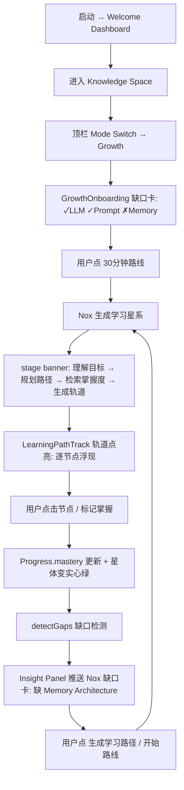

# IMPLEMENTATION-KNOWLEDGE-GALAXY-MVP.md

> Knowledge Canvas v1.3 — Knowledge Galaxy MVP 实现规划
> 阶段：**只规划，暂不编码**｜ 上游：`DESIGN-KNOWLEDGE-GALAXY.md`（v1.2-draft）｜ `PRODUCT-REVIEW-KNOWLEDGE-GALAXY.md`（5 项调整已确认）
> **本文档状态：v1.3-final（评审通过，待确认后进入编码）**

---

## 0. 状态与约束

| 约束 | 说明 |
|---|---|
| ① 仅扩展 | 所有改动限定在 `packages/apps/knowledge-canvas-ui/` |
| ② 不改 `llm-router` | 不读取/不修改 `packages/llm/llm-router/` |
| ③ 不改 `ai-provider-manager` | 不读取/不修改 `packages/llm/ai-provider-manager/` |
| ④ 不改 `agent-loop` | 不读取/不修改 `packages/core/agent-loop/` |
| ⑤ 不接真实 backend | 继续 MockBackend；Galaxy 学习数据用独立 mock 模块模拟 |
| ⑥ 不 commit | 本阶段不提交；评审通过后再进入编码 |

> 本规划为**实现蓝图**，不含任何源码。评审通过后进入编码阶段，仍受上述约束冻结。
> **本文件相对 v1.3-plan-draft 已回写产品评审的 5 项调整**（§1.3–§1.6），并补完文件清单影响范围、Space 兼容策略、MockBackend 数据结构、验收 checklist（§2.3 / §3.4 / §5）。

---

## 1. v1.3 实现范围冻结

### 1.1 IN scope（8 项 MVP，采纳评审命名）
1. **Mode Switch** — Knowledge **Space** ↔ Knowledge **Growth**（用户面标签用 Growth，Galaxy 仅作内部视觉概念）。
2. **Galaxy Canvas 骨架** — 星系视图（概念星体 + 引力连线 + 焦点导航），Growth 模式下的视觉底座。
3. **Concept Node** — 概念 / 技能 / 学习路径节点渲染（含 mastery 环）。
4. **mastery 掌握度展示** — 环形进度 + 星体实心度/光晕。
5. **Learning Path 轨道** — 有序节点链 + 点亮动效 + 进度聚合。
6. **Nox 缺口雷达** — 基于进度图推断缺失前置，推送缺口卡（Personal Knowledge Navigator 形态）。
7. **Insight Panel 升级 + Learning Overview** — Galaxy/Growth 态：Nox 缺口卡 + 第 5 CTA「生成学习路径」；左栏最小「学习概览」面板（完整 Dashboard 延后 v1.4）。
8. **Canvas Background Personalization（基础版）** — `Settings → Appearance → Canvas Background`；Space / Growth / Desktop 三处背景可设本地图片（png/jpg/webp）、Apple 风格渐变、Fill/Fit/Center/Blur 模式；本地存储、不上传（详见 § Product Experience Enhancement §1）。

### 1.2 OUT of scope（明确冻结，v1.3 不做）
- 真实 backend / Embedding / Knowledge Graph 持久化（仅 mock，UI 标注「演示」）。
- Memory 真实持久化（进度仅前端态，序列化为 mock）。
- `llm-router` / `agent-loop` / `ai-provider-manager` 任何调用（Nox 行为由 mock sequencer 模拟）。
- 多用户 / 协作 / 云同步。
- 力导向布局引擎自研（MVP 用**确定可复现**的层次/径向布局）。
- 布偶猫/边牧 Mascot 真实资产（仍占位，Mascot v1.0 铁律）。
- 完整 Learning Dashboard（仅 v1.3 最小学习概览，完整版 v1.4）。
- AI Employee 真实能力增强接线（仅建模 + Nox 知识覆盖率可视化，不接 Agent Core/Memory）。
- **Product Experience Enhancement 中标记 v1.4 的项**：Today Dashboard 完整 UI、Agent Workspace 完整 UI、AI Activity Timeline 完整 UI、Command Palette 完整 UI、AI Employee Growth 完整可视化、Background Personalization 高级版（AI 主题 / 动态桌面）。v1.3 仅做其**模型冻结 / 类型预留 / 最小钩子**（见 §1.7）。

### 1.3 产品定位冻结（调整①）
- **用户面入口标签 = `Growth（成长）`**；「Galaxy」仅作为**内部视觉概念**（星场/星体隐喻）保留，**不出现在主标签**。
- 心智模型：
  - **Space = 我的知识资产**（我有什么）
  - **Growth = 我的能力成长**（我懂什么 / 还缺什么）
- 一句话价值主张（首屏可达）：*「这里帮你把知识变成能力。」*

### 1.4 Space / Growth 边界冻结（调整⑤）
| 维度 | Space | Growth |
|---|---|---|
| 节点类型 | document / video / conversation / project / memory / task | concept / skill / learningPath |
| 导入入口 | ✅ **唯一导入入口** | ❌ **不允许直接导入文件** |
| 目的 | 资产管理 / 整理 / 检索 | 理解 / 学习 / 发现未知 |
| AI 角色 | 整理、聚类、检索建议 | Personal Knowledge Navigator：缺口/路径/关系/下一步 |
| 「加入」语义 | 导入真实文件 | 把概念纳入个人星系（从资产抽取或学习路径生成） |

> **冻结规则**：导入只在 Space；Growth 的「加入成长」仅纳概念，不触发文件导入。违反此规则将模糊两模式边界。

### 1.5 首开体验冻结：缺口驱动（调整②）
- **禁止空白星系**。首次进入 Growth：不展示空旷星场，而是展示 **`GrowthOnboarding`**（Nox Knowledge Navigator 缺口卡）：
  ```
  Nox · Personal Knowledge Navigator
  ───────────────────────────────
  发现你的知识缺口：

  ✓ LLM 基础
  ✓ Prompt Engineering

  缺少：
  ✗ Memory Architecture

  推荐成长路径：
  ⏱ 30 分钟 · AI Agent Memory 入门
  [ 开始 30 分钟路线 → ]
  ```
- 用户点「开始」→ 直接进入该路径轨道（缺口驱动探索），而非在空白星图上自己摸索。
- mock 预置上述缺口状态（非空），保证首开即「有主张」。

### 1.6 Nox 角色冻结（调整④）
- **定义：Personal Knowledge Navigator（个人知识导航员）**，**不是聊天助手**。
- 职责四件套（写入员工注册表 `role` 文案与 mock ownerAgent）：
  1. **Knowledge Gap Detection** — 识别缺失前置/未掌握概念。
  2. **Learning Path Planning** — 生成有序、带 `reason` 的学习路径。
  3. **Relationship Explanation** — 解释概念间关系（前置/相关/组成）。
  4. **Next Action Recommendation** — 推荐下一步（学什么、何时、为什么）。
- **与聊天机器人边界**：Navigator 主动推送、有主张，输出是 **OS 实体**（缺口卡/路径/下一步行动），Chat 只是其一个通道；Galaxy 中 Nox 主表面是 Insight 缺口卡 + 路径轨道，不是聊天框。

### 1.7 Product Experience Enhancement 与 v1.3/v1.4 边界
6 项产品体验增强（完整设计见文末 `## Product Experience Enhancement` 章节）。v1.3 / v1.4 归属如下，原则：**v1.3 只做「模型冻结 + 最小可解释/可视化钩子」，所有完整 UI 推到 v1.4**；不接真实 backend / Agent Core / LLM Router（仍 Mock）。

| # | 功能 | v1.3（MVP 落地） | v1.4（后续） |
|---|---|---|---|
| 1 | Canvas Background Personalization | ✅ 基础版：选图 + 本地预览 + 保存 + Fill/Fit/Center/Blur + 默认渐变自适应 | AI 主题背景、按领域切换环境、动态桌面 |
| 2 | Today Dashboard（每日 AI 首页） | 仅数据模型 / 类型预留（`TodaySnapshot`），不实现 UI | ✅ 完整每日首页（AI 发现 / 成长 / 任务 / 员工状态 / 下一步） |
| 3 | Agent Workspace（AI 员工工作空间） | ✅ **员工模型冻结**（`AgentProfile`：Identity/Personality/Skills/Memory/Scope/Tasks + Nox 角色文案） | ✅ 员工工作空间 UI（Agent Level / Skill Growth） |
| 4 | AI Activity Timeline（AI 行为透明） | ✅ **可解释性数据模型**：节点/边/路径带 `reason`、缺口带依据（满足「所有 AI 行为可解释」） | ✅ 完整 Activity Log UI（时间线 + 接受/撤销/忽略） |
| 5 | Command Palette（全局 AI 命令） | 仅契约预留（⌘/Ctrl+K 占位），不实现面板 | ✅ 完整命令面板（搜索/创建/调用员工/切模式/建任务） |
| 6 | AI Employee Growth（AI 员工成长） | ✅ **建模 + Nox 知识覆盖率可视化**（如 60% 指示） | ✅ 完整成长可视化（Level / Skill Growth / 待提升清单） |

### 1.8 信息架构（IA）总览（更新）
```
AI Employee OS
├─ Today（每日首页 · v1.4 入口）─────────── 未来默认首屏
├─ TopBar
│   ├─ ModeSwitch:  Space（我的知识资产） · Growth（我的能力成长）
│   └─ ⌘/Ctrl+K → Command Palette（v1.4 全局命令）
├─ LeftNav（随模式切换）
│   ├─ Space:  资产 / 聚类 / 检索
│   └─ Growth: 概念树 / 学习路径 / 缺口雷达 / 学习概览
├─ Center
│   ├─ Space Canvas（v1.1 沿用）
│   └─ Growth Galaxy（星系视图 + 轨道 + 缺口驱动首开）
├─ Right   AI Insight Panel（Nox Navigator 缺口卡 + 5 CTA）
├─ BackgroundLayer（三类背景个性化，§ Product Experience Enhancement §1）
└─ Agent Workspace（v1.4：员工 Identity/Personality/Skills/Memory/Growth）
```
> AI Activity Timeline 作为全 OS 透明层，未来挂 Right 或独立面板；v1.3 仅以 `reason` 数据内嵌于节点/边/路径，不单独渲染。

---

## 2. 文件变化清单（v1.3-final）

> 全部限定在 `packages/apps/knowledge-canvas-ui/`，**不影响其他包**。

### 2.1 新增文件（14）
| 文件 | 职责 | 影响范围 |
|---|---|---|
| `src/components/ModeSwitch.tsx` | 顶栏 Space / **Growth** 切换控件（标签用 Growth） | 新 UI 控件，独立 |
| `src/components/GalaxyCanvas.tsx` | Growth 星系视图（复用 canvas 渲染底座） | 新视图，不与 Space 耦合 |
| `src/components/GalaxyNode.tsx` | Concept / Skill / LearningPath 节点渲染（含 mastery 环） | 新节点组件 |
| `src/components/LearningPathTrack.tsx` | 路径轨道 SVG + 逐节点点亮动效 | 新组件 |
| `src/components/MasteryRing.tsx` | 掌握度环（SVG，视觉沿用 ThinkingRing） | 新小组件 |
| `src/components/NoxGapCard.tsx` | Insight Panel 中的 Nox 缺口卡（Navigator 形态） | 新组件，入 Insight |
| `src/components/GrowthOnboarding.tsx` | **首开缺口驱动卡**（Nox Navigator 迎接，调整②） | 新组件，Growth 首屏 |
| `src/components/LearningOverview.tsx` | **学习概览面板**（当前目标/已掌握数/缺口/下一步，调整③） | 新组件，入 Growth 左栏 |
| `src/mock/galaxy.ts` | Galaxy mock：概念种子 / 路径生成 / 缺口检测 / 进度 | 新 mock 模块 |
| `src/galaxyLayout.ts` | 纯函数星系布局（径向/层次，确定可复现） | 新纯函数模块 |
| `src/components/BackgroundLayer.tsx` | 全局背景层（image/blur/overlay），Space/Growth/Desktop 复用 | 新组件，最底层 |
| `src/components/SettingsPanel.tsx` | 设置面板容器（`Settings → Appearance` 入口） | 新 UI，独立 |
| `src/components/AppearanceSettings.tsx` | Canvas Background 设置（选图/模式/模糊/遮罩） | 新组件，入 Settings |
| `src/hooks/useAppearance.ts` | 读取/写入 `CanvasAppearance`（localStorage），按 mode 区分背景 | 新 hook |

> **v1.4 才新增的组件（v1.3 不新增，仅类型预留）**：`TodayDashboard.tsx` / `AgentWorkspace.tsx` / `ActivityTimeline.tsx` / `CommandPalette.tsx` / `EmployeeGrowth.tsx` —— 对应 § Product Experience Enhancement 的 #2/#3/#4/#5/#6 完整 UI，v1.3 阶段不落地（见 §1.7 边界）。

### 2.2 修改文件（11，均限本包内）
| 文件 | 改动 |
|---|---|
| `src/types.ts` | 扩展 `NodeKind`（+ `memory`/`task`/`concept`/`skill`/`learningPath`）+ Galaxy 可选字段；新增 `Relationship` / `LearningPath` / `Progress` / `AIRecommendation` / `CanvasAppearance` |
| `src/store/canvasStore.ts` | 新增 `mode` / `learningPaths` / `progress` / `recommendations` / `appearance` 状态与 actions；复用 `clusters`/`aiStage`/`fitToContent`；`clearAiGenerated` 扩展；`setAppearance` 持久化到 localStorage |
| `src/App.tsx` | 持有 `mode`；渲染 `ModeSwitch` + 按 mode 分发 Space / Growth；挂载 `<BackgroundLayer/>` 于最底层 |
| `src/components/CanvasRegion.tsx` | 承载 `ModeSwitch`，分发 Space / Growth 视图 |
| `src/components/AIInsightPanel.tsx` | Growth 态：Nox 缺口卡 + 第 5 CTA「生成学习路径」；Navigator 口吻 |
| `src/components/SideNav.tsx` | Growth 视图入口（概念树 / 学习路径 / 缺口雷达）+ 内嵌 `LearningOverview` |
| `src/aiStages.ts` | 新增 Galaxy 阶段（理解目标→规划路径→检索掌握度→生成轨道） |
| `src/mock/sequencer.ts` | 新增 Galaxy 序列（生成路径→点亮→检测缺口→首开缺口预置） |
| `src/mock/data.ts` | 新增 Galaxy 概念种子（LLM基础…AI Employee，含 `prerequisites`）+ 首开缺口态 |
| `src/utils.ts` | 新增 Galaxy 节点尺寸常量（`GALAXY_NODE_W` / `GALAXY_NODE_H`） |
| `src/styles/app.css` | Galaxy/Growth 样式：星体 / 轨道 / 缺口脉冲 / 模式切换 / 学习概览；背景层 / 模糊 / 遮罩 / 节点对比增强；深色 + `reduced-motion` |

### 2.3 与 v1.1 Space 的兼容策略
- **默认 mode = `space`**；`ModeSwitch` 默认选中 Space，启动路径与 v1.1 完全一致（Welcome → Space）。
- **Space 核心文件不修改或仅最小兼容**：`CanvasViewport` / `EdgeLayer` / `ClusterFrame` / `KnowledgeNode` / `WelcomeDashboard` 等保持 v1.1 原样；Galaxy 用独立 `GalaxyCanvas`，避免污染 Space 逻辑。
- **Store 字段语义不破坏**：新增 `mode`/`learningPaths`/`progress`/`recommendations` 为**增量字段**；Space 既有 `clusters`/`aiStage`/`fitToContent` 语义不变。
- **状态隔离**：切到 Growth 不清除 Space 的节点/聚类/aiStage；切回 Space 时 Space 状态保留，零回归。
- **回归核对清单（编码后必跑）**：
  - [ ] 启动 → Welcome → 进入 Space → 运行 AI demo → 聚类/Insight 正常（v1.1 行为不变）
  - [ ] `ModeSwitch` 默认 Space；切 Growth 再切回 Space，Space 视图与状态保留
  - [ ] Space 的 fit-to-content / Cluster Frame / 三栏结构视觉无变化
  - [ ] 所有新增样式用 `--dsw-alias-*` 映射，未自造 token

---

## 3. 技术方案

### 3.1 CanvasViewport 是否复用
**结论：复用渲染底座，Growth 独立组件。**
- **复用**：`world-layer`（CSS transform 平移缩放）、`EdgeLayer`（SVG 边覆盖层）、`ClusterFrame`、`ThinkingRing`、`useStore` 选择器、`fitToContent` 逻辑。
- **新增 `GalaxyCanvas.tsx`**：作为 Growth 视图，导入同样的 `EdgeLayer` / `ClusterFrame` / `ThinkingRing`，但使用 `galaxyLayout()` 计算坐标、`GalaxyNode` 渲染节点。
- **理由**：避免把 Galaxy 逻辑塞进 Space 的 `CanvasViewport`；两视图各自纯粹，底座（pan/zoom/edge/cluster）共享 → 符合「扩展不重写」。
- **App 层分发**：`mode==='space'` → `<CanvasViewport/>`（v1.1 原样）；`mode==='growth'` → `<GalaxyCanvas/>`（首屏先渲染 `GrowthOnboarding` 缺口卡）。

### 3.2 Node / Edge 数据模型扩展
在 `src/types.ts` 扩展（前端原型，类型擦除无跨包风险）：
```ts
// 仅规划草案 — 编码阶段落地
type NodeKind =
  | 'document' | 'video' | 'conversation' | 'project'   // 沿用 v1.1 (Space)
  | 'memory' | 'task'                                     // Space 新增资产
  | 'concept' | 'skill' | 'learningPath'                 // Growth 新增

interface KnowledgeNode {
  // ... 沿用 v1.1 字段 ...
  relatedCount?: number      // 关联知识数量
  mastery?: number           // 理解程度 0-100
  aiSuggestion?: string      // AI 建议
  nextActions?: ActionRef[]  // 下一步行动
}

type RelationType = 'prerequisite' | 'related' | 'part-of' | 'leads-to'
interface Relationship {       // 扩展 v1.1 KnowledgeEdge
  id: string; from: string; to: string
  type: RelationType
  weight?: number; confidence?: number; reason?: string
}
interface LearningPath {
  id: string; title: string; goal: string
  steps: PathStep[]; createdBy: AgentId; estimatedMinutes: number
}
interface PathStep {
  nodeId: string; order: number
  prerequisites?: string[]; masteryRequired?: number; reason?: string
}
interface Progress {
  nodeId: string; mastery: number
  status: 'unknown' | 'learning' | 'mastered'; lastReviewedAt?: number
}
interface AIRecommendation {
  id: string; type: 'gap' | 'path' | 'next'
  nodeId?: string; suggestedPathId?: string
  message: string; agentId: AgentId; actions: ActionRef[]
}
```
> 现有 `KnowledgeEdge` 保留供 Space；Galaxy 用 `Relationship`（后续可统一）。`mastery`/`progress` 作为一等数据，未来反哺 Employee context（v1.3 仅建模 + 可视化）。

### 3.3 Store 扩展
- **新状态**：`mode`、`learningPaths: Record<string,LearningPath>`、`progress: Record<string,Progress>`、`recommendations: AIRecommendation[]`。
- **新 actions**：
  - `setMode(m)` — 切换视图；切到 growth 时调用 `galaxyLayout` 重排 + 触发 `GrowthOnboarding`（首开缺口）。
  - `addLearningPath(p)` / `setActivePath(id)`。
  - `setMastery(nodeId, v)` / `markMastered(nodeId)` — 更新 `progress.status`。
  - `detectGaps()` — 基于 `progress` + `Relationship` 推断缺失前置 → 产出 `AIRecommendation(type:'gap')`（ownerAgent `'nox'`）。
  - `addRecommendation(r)` / `clearAiGenerated()` **扩展**：移除 `ownerAgent==='nox'` 本轮产物（路径/缺口建议/AI 自动连线），**保留用户手动 mastery**。
- **复用**：`clusters` / `aiStage` / `fitToContent` / `autoClusterIfNeeded` 不变。
- **选择器**：`useMode()` / `useLearningPaths()` / `useProgress()` / `useRecommendations()`（沿用 `useSyncExternalStore` 零依赖模式）。

### 3.4 MockBackend 数据结构（调整：钉死契约桩）
现有 `KnowledgeBackend`（Space 用）**不改**。新增 `GalaxyBackend` 接口 + mock 实现于 `src/mock/galaxy.ts`，**契约固定、未来零 UI 改动替换**。

**(a) 概念种子 DAG（含 prerequisites 与 mock 初始进度）**
| id | 标题 | 类型 | prereq | mastery | status |
|---|---|---|---|---|---|
| `c-llm` | LLM 基础 | concept | — | 80 | mastered |
| `c-prompt` | Prompt Engineering | concept | `c-llm` | 75 | mastered |
| `c-tool` | Tool Calling | concept | `c-prompt` | 40 | learning |
| `c-memory` | Memory Architecture | concept | `c-tool` | 0 | unknown ← **缺口** |
| `c-agent` | Agent Framework | concept | `c-memory` | 0 | unknown |
| `c-multi` | Multi Agent | concept | `c-agent` | 0 | unknown |
| `c-employee` | AI Employee | concept | `c-multi` | 0 | unknown |

**(b) 首开缺口态（GrowthOnboarding 预置，调整②）**
- 已掌握：`c-llm` ✓、`c-prompt` ✓
- 缺口：`c-memory` ✗（前置 `c-tool` 仅 40 → 未达标）
- 推荐路径：`p-memory-intro`（30 分钟 · AI Agent Memory 入门），steps：`c-memory` → `c-agent`（入门级裁剪）

**(c) 接口契约桩**
```ts
interface GalaxyBackend {
  getConcepts(): Promise<ConceptNode[]>          // 概念种子 DAG
  getProgress(): Promise<Record<string, Progress>>   // mock 初始掌握度
  generateLearningPath(goal: string): Promise<LearningPath>  // 按 DAG 裁剪，每步带 reason
  detectGaps(progress: Record<string,Progress>,
             rels: Relationship[]): Promise<AIRecommendation[]>  // 找未达标前置
  explainRelationship(a: string, b: string): Promise<string>    // Navigator 关系解释
}
```
- mock 实现全部本地、无网络、无真实 LLM；缺口检测为**规则级**（前置未达 `masteryRequired` 即缺口），UI 标注「演示」。
- `ownerAgent` 固定 `'nox'`（Personal Knowledge Navigator）。

### 3.5 动画如何实现
- **复用**：`ThinkingRing`（生成态旋转环）、revealing 缓动（CSS transition）。
- **Learning Path 轨道点亮**：SVG `<path>` 用 `stroke-dasharray` + `stroke-dashoffset` 过渡做「绘制」；节点按 `order` 用 `transition-delay` 逐个 `scale/opacity` 浮现。
- **Mastery 环**：SVG `<circle>`，`stroke-dasharray=2πr`，`stroke-dashoffset=(1-mastery)*2πr`，值变化时过渡。
- **缺口节点**：虚线描边 + `?` 徽标 CSS `pulse`；低掌握星体降透明度。
- **降级**：全部动效包 `@media (prefers-reduced-motion: reduce)` 关闭，退化为静态。

### 3.6 Canvas Personalization 技术方案（详见 § Product Experience Enhancement §1）
- **背景层组件**：新增 `BackgroundLayer.tsx`，绝对定位、`z-index` 低于 `world-layer`，位于 viewport 内；按 `mode` 读取 `CanvasAppearance`，渲染默认渐变或本地图片。
- **模式实现**：Fill→`background-size:cover`；Fit→`contain`；Center→`center`；Blur→`cover` + `filter:blur(blur)`。上层叠 `::after` 暗色遮罩（`opacity:overlayOpacity`）。
- **可读性三层保护**：模糊层 + 暗色遮罩 + 节点卡片对比增强（毛玻璃/描边/投影），确保任意背景节点清晰（§8.3）。
- **存储**：`useAppearance` 用 `useSyncExternalStore` 订阅 localStorage 的 `appearance` 键；`setAppearance` 写入并触发重渲染；图片以 dataURL 存（超体积提示）。
- **约束**：纯前端，不影响 MockBackend；不触碰 `llm-router`/`agent-loop`。

---

## 4. 交互流程



**分步说明：**
1. 启动 → Welcome Dashboard → 进入 Knowledge Space（v1.1 原样）。
2. 顶栏 `ModeSwitch` 切到 **Growth** → `setMode('growth')`，`galaxyLayout` 重排概念星体。
3. **首开即 `GrowthOnboarding` 缺口卡**（非空白星场）：显示已掌握/缺口/推荐 30 分钟路线。
4. 用户点「开始 30 分钟路线」→ Nox（mock sequencer）进入 `inferring`，stage banner：`理解目标→规划路径→检索掌握度→生成轨道`。
5. `galaxyBackend.generateLearningPath` 返回路径 → `LearningPathTrack` 沿轨道逐节点点亮（动效 §3.5）。
6. 用户点击某节点（如 Tool Calling）→ 局部放大 + 详情卡（含 `reason` 解释，Navigator 职责③）。
7. 用户点〔标记掌握〕→ `markMastered` → `Progress` 更新 → 星体变实心绿、MasteryRing 满环；`LearningOverview` 已掌握数 +1。
8. `detectGaps` 比对 `progress` 与 `prerequisites` → 发现 Memory Architecture 为 `unknown`。
9. Insight Panel 推送 Nox 缺口卡（Navigator 形态）：「你已 ✓Tool，缺 ✗Memory Architecture，推荐 30 分钟路线」+〔生成学习路径〕。
10. 用户点〔生成学习路径〕→ 回到步骤 4（子路径），形成**学习飞轮**，呼应核心闭环（Input→Graph→Gap→Path→Skill→Employee 增强）。
11. 全部完成 → Insight Panel 成就卡 + 推荐进阶路径（Multi Agent → …）。
12. 任意时刻 `Undo` → `clearAiGenerated()` 移除本轮 AI 产物（路径/缺口/AI 连线），保留手动 mastery。

---

## 5. 验收 checklist

### 5.1 UI 符合 Apple Design System
- [ ] 颜色仅用 `--dsw-alias-*`；Growth 新语义色（`growth-concept` / `growth-skill` / `growth-gap`）映射到现有 alias，不自造 token。
- [ ] 大圆角卡片、毛玻璃、弹簧动效；浅/深色双主题；`prefers-reduced-motion` 降级。
- [ ] Mascot 仅裁切母版 PNG（布偶猫/边牧占位）。
- [ ] 节点配人话描述（如「Memory Architecture：让 Agent 记住历史对话」），非仅标题。

### 5.2 不破坏 v1.1 Space 模式
- [ ] `ModeSwitch` 默认 Space；启动→Welcome→Space 路径与 v1.1 一致。
- [ ] Space 的 fit-to-content / Cluster Frame / AI demo / 三栏视觉无变化（§2.3 回归清单全过）。
- [ ] 切 Growth 再切回 Space，Space 状态保留。

### 5.3 产品定位与边界（新增校验）
- [ ] 用户面标签为 **Growth（成长）**，不出现裸「Galaxy」主标签。
- [ ] **首开 Growth 显示缺口卡，不是空白星场**（§1.5）。
- [ ] **Growth 无文件导入入口**；导入仅在 Space（§1.4 冻结规则）。
- [ ] Nox 角色呈现为 **Personal Knowledge Navigator**，非聊天框（缺口卡/路径轨道为主表面）。

### 5.4 所有 AI 行为可解释
- [ ] AI 生成的每个节点 / 边 / 路径步骤带 `reason`；缺口带依据（缺哪些前置 + 建议路径）。
- [ ] Insight Panel / Onboarding 显示 Nox Navigator 口吻解释文案。
- [ ] 关系 / 路径来源可在详情卡展开查看。
- [ ] mock 缺口检测 UI 标注「演示」（规则级，非真实推断）。

### 5.5 所有 AI 修改可撤销
- [ ] Growth 生成的路径 / 节点 / 缺口建议标记 `ownerAgent:'nox'`，归属本轮。
- [ ] 提供 Undo（按钮 / Ctrl+Z）：`clearAiGenerated()` 扩展移除本轮 AI 产物（路径、缺口建议、AI 自动连线），**保留用户手动 mastery 与手动节点**。
- [ ] 与 v1.1 undo 机制一致（`kind='ai'` 簇、`aiStatus` 过滤）。

### 5.6 Learning Overview（新增校验）
- [ ] Growth 左栏显示「学习概览」：当前学习目标 / 已掌握概念数量 / 待补知识缺口 / 推荐下一步。
- [ ] 数据随 `progress` / `recommendations` 实时更新。
- [ ] 完整 Dashboard 不在此版本（仅最小面板，v1.4 扩展）。

### 5.7 Canvas Personalization 验收（详见 § Product Experience Enhancement §1）
- [ ] 选图后 Fill/Fit/Center/Blur 模式正确渲染；blur/overlay 滑块实时生效。
- [ ] 任意背景下节点文字/连线清晰可读（自动模糊层 + 暗色遮罩 + 节点对比增强生效）。
- [ ] 设置持久化到 localStorage，刷新后保留；图片不出现于网络请求（devtools Network 无上传）。
- [ ] Space / Growth / Desktop 背景可独立设置（v1.3 若共享则至少默认背景随 mode 适配）。

### 5.8 Product Experience Enhancement（v1.3 落地部分）
- [ ] Background Personalization 基础版可用：选图 / 四模式 / 模糊 / 遮罩 / 本地存储（§ Product Experience Enhancement §1）。
- [ ] Agent Workspace **模型冻结**：`AgentProfile` 类型含 Identity/Personality/Skills/Memory/Scope/Tasks；Nox `role='Personal Knowledge Navigator'` 文案落地（§PE §3）。
- [ ] AI 可解释性数据模型落地：所有 AI 生成节点/边/路径步骤带 `reason`；缺口带依据（§PE §4 / §5.4）。
- [ ] AI Employee Growth 建模 + Nox 知识覆盖率可视化（如 60% 覆盖率指示）出现于 Growth 视图（§PE §6）。
- [ ] Today Dashboard / Command Palette / 完整 Activity Timeline / Agent Workspace UI 在 v1.3 **不实现**（仅类型预留），由 §1.7 边界保证不越界。

### 5.9 Product Experience Enhancement（v1.4 展望，不在 v1.3 验收）
- [ ] Today Dashboard：每日首屏展示 AI 今日发现 / 新知识关联 / 学习目标 / 项目状态 / 员工状态 / 推荐下一步。
- [ ] AI Activity Timeline 完整 UI：时间线 + 每步原因（相似度/同项目/时间关联）+ 接受/撤销/忽略。
- [ ] Command Palette（⌘/Ctrl+K）：搜索知识 / 创建节点 / 调用 AI Employee / 打开 Memory / 切 Space·Growth / 建任务。
- [ ] Agent Workspace UI：员工 Identity/Personality/Skills/Memory/Scope/Tasks 可视化 + Agent Level / Skill Growth。
- [ ] AI Employee Growth 完整可视化：User Growth + AI Employee Growth 双轴 + 待提升清单 + 未来 Memory/Skill/Agent Runtime 接线点。
- [ ] Background Personalization 高级版：AI 自动主题背景 / 按知识领域切换环境 / 动态桌面。

---

## Product Experience Enhancement（产品体验增强）

> 本章汇总 6 项产品体验增强（背景个性化 / 每日首页 / 员工工作空间 / AI 行为透明 / 全局命令 / 员工成长）。
> **v1.3 / v1.4 归属见 §1.7**；**IA 总览见 §1.8**。原则：v1.3 只做模型冻结 + 最小钩子，完整 UI 推 v1.4；全程 **Mock 数据、不接真实 backend / Agent Core / LLM Router**。

### 1. Canvas Background Personalization（背景个性化）

#### 1.1 功能定位
用户可选择**本地图片**作为三类背景，类似 macOS 桌面壁纸体验：
- **Knowledge Space 背景**
- **Growth / Galaxy 背景**
- **AI Employee Desktop 背景**

入口层级：
```
Settings → Appearance → Canvas Background
```

#### 1.2 支持的背景与模式
- **背景来源**：默认背景（Apple 风格渐变，浅/深自动适配）/ 本地图片（png / jpg / webp）。
- **背景模式**：`Fill`（填充）/ `Fit`（适应）/ `Center`（居中）/ `Blur`（模糊）。
- **可调参数**：`blur`（0–20px 模糊）/ `overlayOpacity`（0–0.8 暗色遮罩）。

#### 1.3 视觉规则（可读性保护，硬约束）
背景**绝不能影响知识节点可读性**。系统自动提供三层保护：
1. **背景模糊层**（`blur`）—— 降低图片高频细节干扰。
2. **暗色遮罩**（`overlayOpacity`）—— 统一降低背景亮度对比。
3. **节点对比增强** —— 节点卡片加毛玻璃/描边/投影，保证与任意背景的可辨识度。

渲染管线（与 `world-layer` 解耦）：
```
Background Layer → Blur / Overlay → Canvas World → Knowledge Nodes
```
`BackgroundLayer` 位于 `world-layer` 之下、viewport 之内，随 `mode` 切换（Space / Growth / Desktop 各自独立背景）。

#### 1.4 数据模型预留
```ts
interface CanvasAppearance {
  backgroundType: 'default' | 'image'
  backgroundImage?: string      // 本地图片 dataURL / objectURL，绝不外传
  blur: number                  // 0–20
  overlayOpacity: number        // 0–0.8
  // 可扩展：perMode?: { space?: CanvasAppearance; growth?: CanvasAppearance; desktop?: CanvasAppearance }
}
```
- `backgroundImage` 仅存**本地**（localStorage / IndexedDB），**不上传服务器**。
- 三处背景（Space / Growth / Desktop）可各自设置；MVP 先共享单一 `CanvasAppearance`，`perMode` 留接口。

#### 1.5 约束
- ❌ 不上传服务器；图片仅本地存储。
- ❌ 不影响 MockBackend（纯前端外观状态）。
- ❌ 不修改 `llm-router` / `agent-loop`（Agent Core）。
- ✅ 复用现有 `useStore` 模式；appearance 用独立轻量 store 或并入 `canvasStore`。

#### 1.6 实现分级
- **v1.3 基础版（本阶段实现）**：图片选择（文件 picker，限 png/jpg/webp）+ 本地预览 + 保存设置（localStorage）+ Fill/Fit/Center/Blur 模式 + blur/overlay 滑块 + 默认 Apple 渐变背景与浅/深自动适配。
- **v1.4 高级版（后续）**：AI 自动生成主题背景（按知识领域/情绪）/ 根据知识领域自动切换环境 / 动态桌面（随时间/进度渐变）。

#### 1.7 文件变化（本功能，v1.3 落地）
- 新增：`src/components/BackgroundLayer.tsx`、`src/components/SettingsPanel.tsx`、`src/components/AppearanceSettings.tsx`、`src/hooks/useAppearance.ts`
- 修改：`src/types.ts`（+`CanvasAppearance`）、`src/store/canvasStore.ts`（+`appearance`/`setAppearance`）、`src/App.tsx`（挂载 `BackgroundLayer`）、`src/styles/app.css`（背景层/模糊/遮罩/节点对比增强）

#### 1.8 技术要点（渲染与存储）
- `BackgroundLayer` 用绝对定位 `div`（z-index 低于 world-layer），`background-image` + `background-size` 按模式（Fill→cover / Fit→contain / Center→center / Blur→cover+filter:blur）；上层叠 `::after` 暗色遮罩（opacity=`overlayOpacity`）。
- `useAppearance` 用 `useSyncExternalStore` 订阅 localStorage 的 `appearance` 键；`setAppearance` 写入并触发重渲染；图片以 dataURL 存（体积限制，超出则提示）。
- 浅/深自动适配：默认背景下用 `prefers-color-scheme` 或当前 theme 变量切换渐变。

### 2. Today Dashboard（每日 AI 首页）

- **定位**：用户每天打开 AI Employee OS 的**第一屏**；未来默认首屏（v1.4 入口，见 §1.8 IA）。
- **展示**：AI 今日发现 / 新知识关联 / 当前学习目标 / 项目状态 / AI 员工状态 / 推荐下一步。
- **示例**：
  ```
  Today
  AI 发现：12 个新关联
  知识成长：完成 Agent Memory 基础
  任务：继续 LLM Router 接线
  ```
- **v1.3 归属**：仅数据模型 / 类型预留（`TodaySnapshot { discoveries; newLinks; learningGoal; projects; agents; nextActions }`），**不实现 UI**（完整 Dashboard 延后 v1.4，呼应 §1.2 冻结）。
- **约束**：数据由 Mock 聚合，不接真实 backend；不接 Agent Core。

### 3. Agent Workspace（AI 员工工作空间）

- **冻结 AI Employee OS 员工模型（v1.3 建模，v1.4 UI）**：
  ```ts
  interface AgentProfile {
    id: AgentId
    identity: { name: string; mascot: string; emoji: string }
    personality: string
    skills: SkillRef[]
    memory: MemoryRef[]
    knowledgeScope: string[]
    tasks: TaskRef[]
    growth?: { level: number; coverage: number; mastered: string[]; toImprove: string[] }
  }
  ```
- **Nox 例（已落地角色文案）**：
  - Role：**Personal Knowledge Navigator**
  - 负责：Knowledge Gap Detection / Learning Path Planning / Relationship Explanation / Next Action Recommendation
- **未来支持（v1.4）**：Agent Level / Agent Skill Growth（在 `growth` 字段上扩展）。
- **约束**：v1.3 仅类型冻结 + Nox 角色文案；**不接 Agent Core / Memory 真实接线**（仅预留 `memory`/`skills` 引用与「未来连接」注释）。

### 4. AI Activity Timeline（AI 行为透明记录）

- **目的**：所有 AI 行为可解释（呼应 §5.4 验收）。
- **v1.3 归属**：以 `reason` 数据内嵌于节点/边/路径（已落地，满足「所有 AI 行为可解释」）；**不单独渲染 UI**。
- **v1.4 UI 形态（时间线 + 原因 + 操作）**：
  ```
  时间：10:32   动作：导入论文
  AI 行为：发现 3 个相关知识节点
  原因：内容相似度 / 同项目来源 / 时间关联
  操作：[接受] [撤销] [忽略]
  ```
- **文件**：`src/components/ActivityTimeline.tsx`（v1.4 新增）。
- **约束**：原因数据由 Mock sequencer 生成，不接真实 LLM/Router。

### 5. Command Palette（全局 AI 命令）

- **参考**：macOS Spotlight / Raycast / VSCode Command Palette。
- **快捷键**：`⌘ / Ctrl + K`（v1.3 仅占位，v1.4 实现）。
- **支持**：搜索知识 / 创建节点 / 调用 AI Employee / 打开 Memory / 切换 Space·Growth / 创建任务。
- **文件**：`src/components/CommandPalette.tsx`（v1.4 新增）。
- **约束**：v1.3 仅契约预留（不实现面板）；命令执行仍走 Mock，不接真实 backend / Agent Core。

### 6. AI Employee Growth（AI 员工成长）

- **核心理念**：Growth 不只服务用户 —— **User Growth + AI Employee Growth 双轴**。
- **Nox 例**：
  ```
  Nox · Knowledge Coverage: 60%
  ✓ RAG   ✓ Embedding
  ✗ Planning Agent   ✗ Tool Usage
  未来连接：Memory / Skill System / Agent Runtime
  ```
- **v1.3 归属**：建模 + **Nox 知识覆盖率可视化**（如 60% 指示，渲染于 Growth 视图）；`AgentProfile.growth` 类型预留。
- **v1.4 完整可视化**：Agent Level / Skill Growth / 待提升清单 + 未来 Memory / Skill System / Agent Runtime 接线点。
- **约束**：不接 Memory / Skill System / Agent Runtime（仅预留接线点）；覆盖率由 Mock 进度聚合。

> **v1.3 落地小结**：本章 v1.3 仅实现 **§1 基础版** + **§3/§4/§6 的模型冻结与最小钩子**；§2/§4(UI)/§5/§6(完整) 均为 v1.4。全程 Mock、不越界（见 §1.7）。

---

## 6. 风险与开放问题

| 问题 | 状态 | 建议 |
|---|---|---|
| 星系布局算法（力导向 vs 层次） | 开放 | MVP 用确定可复现层次/径向，v1.4 评估力导向 |
| `mastery` 评估（手动 vs AI 推断） | 开放 | MVP 手动标记 + mock 初值，AI 推断留接口 |
| 缺口误报 | MVP 接受 | `confidence` 阈值 + 用户反馈，MVP 用规则（前置未达标即缺口）；UI 标注「演示」 |
| 普通用户抽象度 | 已缓解 | 靠 Growth 标签 + 缺口驱动首开 + 人话描述 + 渐进披露（§1.3/§1.5/§3.2） |
| 背景干扰可读性 | 已缓解 | 三层保护（模糊层 + 暗色遮罩 + 节点对比增强，§8.3）；blur/overlay 提供默认安全值 |

---

## 7. 下一步（编码阶段，待确认后执行）
1. `ModeSwitch` + `App` 模式分支（默认 Space）
2. `GalaxyCanvas` + `galaxyLayout` + `GalaxyNode`
3. `mastery` / `MasteryRing`
4. `GrowthOnboarding`（首开缺口卡）+ `LearningOverview`（学习概览）
5. `LearningPathTrack` + `NoxGapCard` + `sequencer`
6. 动画与样式打磨（含「演示」标注）
7. Canvas Personalization 基础版（`BackgroundLayer` + `AppearanceSettings` + 本地存储，§ Product Experience Enhancement §1）
8. 验收（§5 checklist，含 §5.7）

---

*文档状态：v1.3-final｜已回写 5 项产品调整（§1.3–§1.6）+ Product Experience Enhancement 章节（§PE：背景个性化/Today/Agent Workspace/Activity Timeline/Command Palette/Employee Growth；§1.7 边界 + §1.8 IA）+ 补完文件影响范围 / Space 兼容 / MockBackend 结构 / 验收 checklist（§5.8–§5.9）｜未编码｜未 commit*
*上游：DESIGN-KNOWLEDGE-GALAXY.md（v1.2-draft）、PRODUCT-REVIEW-KNOWLEDGE-GALAXY.md（5 项调整已确认）*
